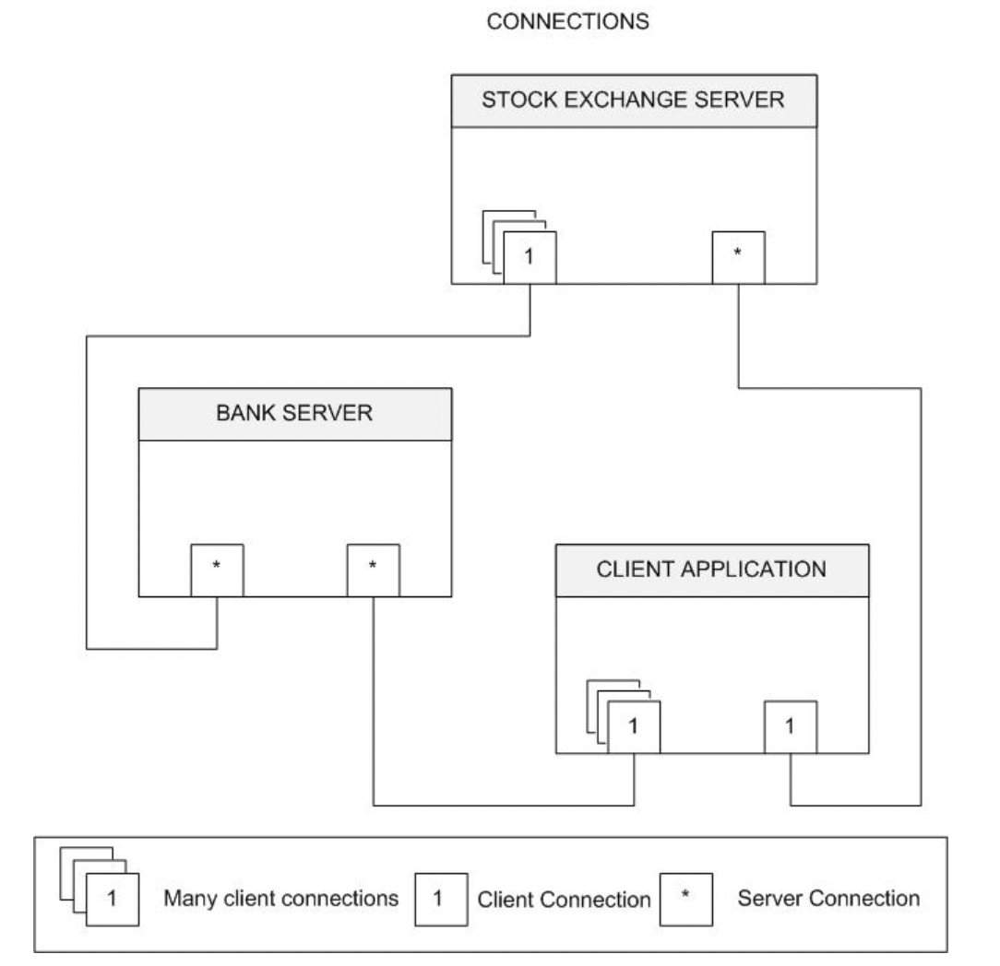
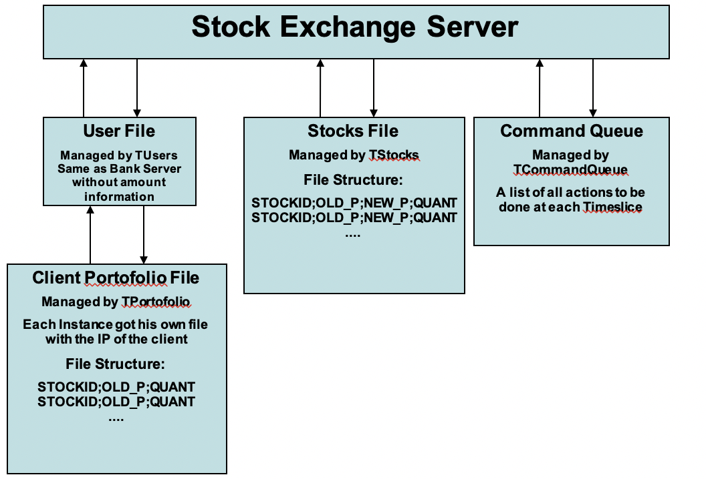

# retro-stockexchange

## Introduction 

In 2007 at university we had a little assignment to explore in a basic manner banks / stock exchanges.
We could choose to do this in every language. As I haven't used C++ in a project till then, I chose that language to learn.

The project consist of 3 seperate applications:

- Bank: Store the users money
- StockExchange: Buy Stocks for users
- Client: Buy stocks with money stored in the bank

{:width="50%"}

{:width="50%"}

![Screenshot 3](images/screen3.png}{:width="50%"}

## Enjoy

